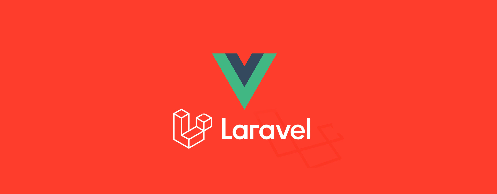

<h1 align="center">Web Design & Development Using Laravel & Vue</h1>
<h3 align="center">A passionate frontend & backend developer from Bangladesh.</h3>

  

- 🔭 I’m currently working on [Paikaree.com.bd](https://paikaree.com.bd/)

- 🌱 I’m currently learning **Laravel**

- 👯 I’m looking to collaborate on [Resturent HTML CSS JS](https://github.com/Mribrahimkhan360/CoResturent)

- 🤝 I’m looking for help with [E-commerce Laravel](https://github.com//ecom-batch4)

- 👨‍💻 All of my projects are available at [https://github.com/Mribrahimkhan360](https://github.com/Mribrahimkhan360)

- 📝 I regularly write articles on [https://mribrahimk.blogspot.com](https://mribrahimk.blogspot.com)
- 🔭 I was working on [Cpp Competitive Programming for Beginners](https://github.com/Mribrahimkhan360/cpp-competitive-programming-for-beginners)

- 💬 Ask me about **Laravel & Vue**

- 📫 How to reach me **mribrahimkhan360@gmail.com**

- 📄 Know about my experiences <a href="https://docs.google.com/document/d/1RMpa03KGFZ9H_MUFFtZ446F4vlPlN79dFbDFEOP3hqw/edit?usp=sharing">CV Download</a>

- ⚡ Fun fact **I think I am funny boy.**

### Blogs posts
<!-- BLOG-POST-LIST:START -->
<!-- BLOG-POST-LIST:END -->

<h3 align="left">Connect with me:</h3>

<!-- 

 -->

<h3 align="left">Languages and Tools:</h3>

                         

<h3 align="left">Support:</h3>

  

&nbsp;

